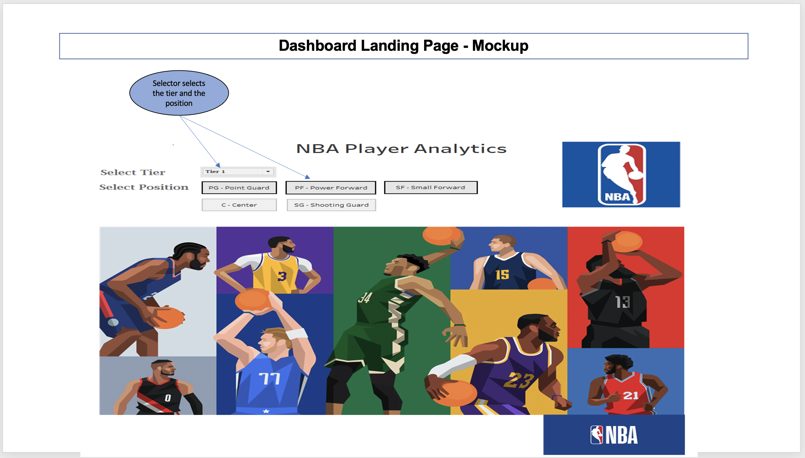
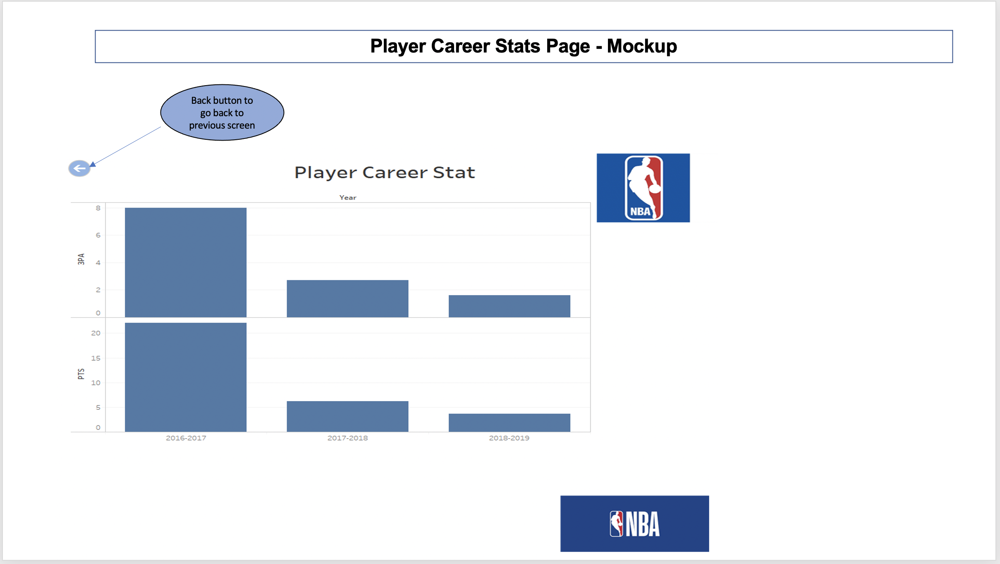
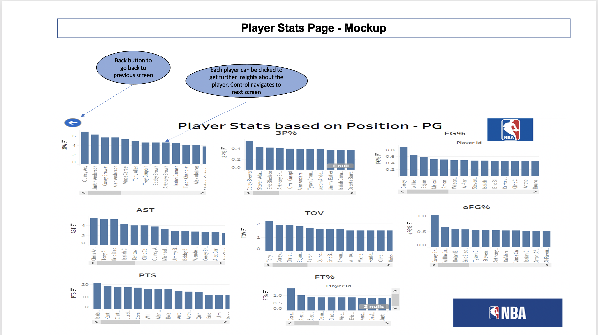

# nba-player-analytics

## Project Overview
There is a new club that wants to build a team and they want to sign up contract with different players.
1. They have a budget of 110 million USD. They want to build a well-balanced team choosing players of different tiers. They want to see players of different tiers so that they can sign up with them
A Colorado Board of Elections employee has given you the following tasks to complete the election audit of a recent local congressional election. 
2. Also the club wanted to know whether a players salary is going to increase, decrease or remains similar in next subsequent seasons based on his performance statistics in NBA. This part of the project can help players who want to predict their salary. 

## Resources 
- Data Source Files for NBA Player Stats
  - NBA Players Stats 201617.csv
  - NBA Players Stats 201718.csv
  - NBA Players Stats 201819.csv
  - NBA STATs19-20.csv
- Data Source Files for NBA Player Salaries
 - NBA Players Stats 201819.csv
 - NBA_salaries_2019_present.csv

## Software
- DataCleanup: Python 3.8.5 Visual Studio Code, 1.54.1
- Database: SQL
- Machine Learning: Python
- Dashboards: Tableau

## Project Summary
The Dashboard that can be used for viewing and comparing a player stats and salary info will be as follows 
- Dashboard Landing Page Mockup: 
- Dashboard Player Career Stats Page Mockup: 
- Dashboard Players Stats Page for Comparison Mockup: 
